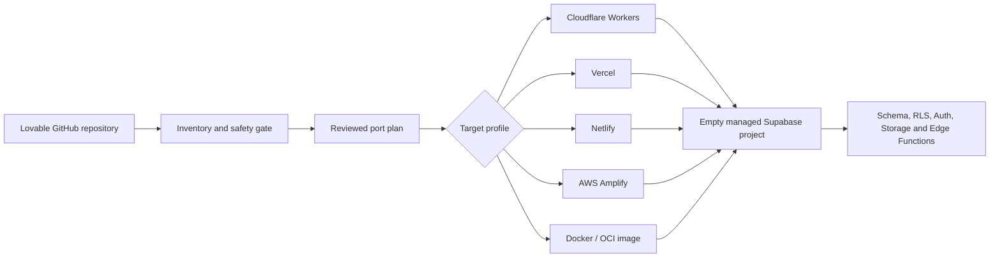

# Lovable Porting Agent

[](https://github.com/adamhjort/lovable-porting-agent/actions/workflows/tests.yml)

Migrate Lovable apps to infrastructure you control. This model-neutral [Agent Skill](https://agentskills.io) and CLI toolkit inventories a Lovable-generated GitHub repository, identifies portability blockers, creates a reviewed migration plan, provisions an empty Supabase pre-production backend, and prepares deployment for Cloudflare Workers, Vercel, Netlify, AWS Amplify, or a portable Docker/OCI image.

The same `SKILL.md`, scripts, and references work with Codex, Claude Code, and other clients that implement the open Agent Skills format.

> [!IMPORTANT]
> This workflow recreates empty pre-production environments with schema, RLS, functions, and synthetic seed data. It does not migrate real users, database rows, storage objects, passwords, or secrets.

## What it automates

- Detects Vite React SPAs and TanStack Start applications.
- Inventories Supabase migrations, Edge Functions, API routes, environment variable names, and runtime dependencies.
- Flags hardcoded Lovable hosts, Lovable-managed AI or email gateways, committed secret candidates, and unsafe background work.
- Produces a machine-readable, approval-gated Lovable migration plan.
- Creates a new empty managed Supabase project using a dry-run-first workflow.
- Evaluates target-specific adapters and generates missing configuration templates.
- Generates redacted deployment evidence and body-free HTTP smoke-test results.
- Preserves the original Lovable environment as the rollback path.

## Architecture



Hosting and backend are represented separately in the target registry. The initial profiles retain managed Supabase because replacing its Postgres, Auth, Storage, Realtime, Edge Functions, and RLS semantics is a larger replatforming project.

## Agent compatibility

| Client | Personal skill location | Invocation |
| --- | --- | --- |
| Codex | `~/.agents/skills/port-lovable-app/` | `$port-lovable-app` |
| Claude Code | `~/.claude/skills/port-lovable-app/` | `/port-lovable-app` |
| Other Agent Skills clients | Client-defined skill directory | Client-defined or automatic |

Install for Codex:

```bash
git clone https://github.com/adamhjort/lovable-porting-agent.git ~/.agents/skills/port-lovable-app
```

Install for Claude Code:

```bash
git clone https://github.com/adamhjort/lovable-porting-agent.git ~/.claude/skills/port-lovable-app
```

For a project-scoped installation, clone or copy it to `.agents/skills/port-lovable-app/` for Codex or `.claude/skills/port-lovable-app/` for Claude Code.

Then invoke it explicitly or ask naturally:

```text
Inventory this Lovable repository and produce a safe dry-run migration plan for the best supported target.
```

The OpenAI-specific `agents/openai.yaml` file is optional UI metadata. It does not change the core workflow and is ignored by other Agent Skills clients. See [`references/agent-compatibility.md`](references/agent-compatibility.md) for tool and approval mapping.

## Run the toolkit directly

Create a secret-safe inventory:

```bash
python scripts/inventory_repo.py /path/to/lovable-repo \
  --out /path/to/lovable-repo/.porting/inventory.json
```

Create a dry-run port plan:

```bash
python scripts/make_port_plan.py /path/to/lovable-repo/.porting/inventory.json \
  --out /path/to/lovable-repo/.porting/plan.json \
  --app-name example-app \
  --target vercel-supabase \
  --target-project-ref empty-project-ref \
  --source-data-classification test-only \
  --source-auth-users 0 \
  --source-storage-objects 0
```

Review the planned operations without executing them:

```bash
python scripts/apply_port_plan.py /path/to/lovable-repo/.porting/plan.json \
  --repo /path/to/lovable-repo
```

Read [`SKILL.md`](SKILL.md) for the complete workflow and approval controls.

## Deployment profiles

| Profile | Frontend and server runtime | Backend | Best fit |
| --- | --- | --- | --- |
| `cloudflare-supabase` | Cloudflare Workers and Static Assets | Managed Supabase | Static SPAs, existing Cloudflare adapter, low operations |
| `vercel-supabase` | Vercel Functions and edge assets | Managed Supabase | TanStack Start with Nitro, Git previews |
| `netlify-supabase` | Netlify Functions and CDN | Managed Supabase | Existing Netlify adapter, deploy previews |
| `aws-amplify-supabase` | AWS Amplify Hosting | Managed Supabase | Explicit AWS placement requirement |
| `docker-supabase` | Portable OCI image | Managed Supabase | Provider portability and later Cloud Run, ECS, Azure, Fly.io, Render, Railway, or Kubernetes deployment |

Target metadata, readiness checks, templates, and deployment commands live in [`scripts/target_profiles.py`](scripts/target_profiles.py). Add a new profile there and a directly linked reference file; the shared data gate, secret rules, approval token, and source protection remain unchanged.

## Safety model

The agent is deliberately conservative:

- read-only inventory before mutation;
- pinned, clean Git commit before deployment;
- secret names only, never secret values;
- aggregate source metadata only for the data-classification gate;
- explicit `test-only` attestation;
- new empty backend instead of an existing production project;
- allowlisted deployment commands;
- no source deletion, disconnection, pause, or overwrite;
- separate human approval for any future teardown.

The Docker profile builds a local image only. Registry push and platform deployment require a separate reviewed operation.

See [`references/safety-and-evidence.md`](references/safety-and-evidence.md) for the full evidence and approval model.

## Supported application patterns

- Lovable-generated Vite + React single-page applications
- Lovable-generated TanStack Start full-stack applications
- Supabase Postgres migrations and Row Level Security policies
- Supabase Auth, Storage, Realtime, and Edge Functions
- Cloudflare Workers, Vercel, Netlify, AWS Amplify, and Docker/OCI targets

Provider APIs and deployment adapters change over time. The skill requires current official documentation to be checked before external provisioning or deployment.

## Test

The toolkit uses only the Python standard library. Run its self-contained tests with:

```bash
python scripts/test_porting.py
```

## Project status

This is an independent migration toolkit and is not affiliated with Lovable, Supabase, Cloudflare, Vercel, Netlify, AWS, Docker, OpenAI, or Anthropic. Review every generated plan before applying it to an external environment.
