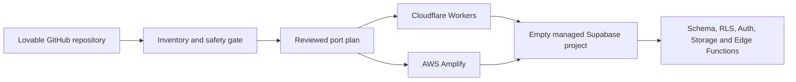

# Lovable Porting Agent

[](https://github.com/adamhjort/lovable-porting-agent/actions/workflows/tests.yml)

Migrate Lovable apps to infrastructure you control. This Codex skill inventories a Lovable-generated GitHub repository, identifies portability blockers, creates a reviewed migration plan, provisions an empty Supabase pre-production backend, and deploys to Cloudflare Workers or AWS Amplify.

It is designed for AI-first development teams that want a repeatable exit path from Lovable without copying production data or disrupting the source application.

> [!IMPORTANT]
> This workflow recreates empty pre-production environments with schema, RLS, functions, and synthetic seed data. It does not migrate real users, database rows, storage objects, passwords, or secrets.

## What it automates

- Detects Vite React SPAs and TanStack Start applications.
- Inventories Supabase migrations, Edge Functions, API routes, environment variable names, and runtime dependencies.
- Flags hardcoded Lovable hosts, Lovable-managed AI or email gateways, committed secret candidates, and unsafe background work.
- Produces a machine-readable, approval-gated Lovable migration plan.
- Creates a new empty managed Supabase project using a dry-run-first workflow.
- Deploys to Cloudflare Workers by default or AWS Amplify when explicitly selected.
- Generates redacted deployment evidence and body-free HTTP smoke-test results.
- Preserves the original Lovable environment as the rollback path.

## Target architecture



The default profile is Cloudflare Workers plus one managed Supabase project per app. AWS Amplify is supported as a hosting alternative while retaining Supabase. Replacing Supabase with AWS-native services is intentionally treated as a separate replatforming project.

## Install as a Codex skill

Clone the repository into your Codex skills directory:

```bash
git clone https://github.com/adamhjort/lovable-porting-agent.git ~/.codex/skills/port-lovable-app
```

On Windows PowerShell:

```powershell
git clone https://github.com/adamhjort/lovable-porting-agent.git "$env:USERPROFILE\.codex\skills\port-lovable-app"
```

Then ask Codex:

```text
Use $port-lovable-app to inventory this Lovable repository and produce a safe dry-run migration plan.
```

The skill starts read-only. External changes require a reviewed plan, `can_apply: true`, and an exact confirmation token.

## Run the toolkit directly

Create a secret-safe inventory:

```bash
python scripts/inventory_repo.py /path/to/lovable-repo \
  --out /path/to/lovable-repo/.porting/inventory.json
```

Create a dry-run port plan:

```bash
python scripts/make_port_plan.py /path/to/lovable-repo/.porting/inventory.json \
  --out /path/to/lovable-repo/.porting/plan.json \
  --app-name example-app \
  --target cloudflare-supabase \
  --target-project-ref empty-project-ref \
  --source-data-classification test-only \
  --source-auth-users 0 \
  --source-storage-objects 0
```

Review the planned operations without executing them:

```bash
python scripts/apply_port_plan.py /path/to/lovable-repo/.porting/plan.json \
  --repo /path/to/lovable-repo
```

Read [`SKILL.md`](SKILL.md) for the complete workflow and approval controls.

## Deployment profiles

| Profile | Frontend and server runtime | Backend | Best fit |
| --- | --- | --- | --- |
| `cloudflare-supabase` | Cloudflare Workers and Static Assets | Managed Supabase | Default, low-operations pre-production hosting |
| `aws-amplify-supabase` | AWS Amplify Hosting | Managed Supabase | Teams with an explicit AWS placement requirement |

## Safety model

The agent is deliberately conservative:

- read-only inventory before mutation;
- pinned, clean Git commit before deployment;
- secret names only, never secret values;
- aggregate source metadata only for the data-classification gate;
- explicit `test-only` attestation;
- new empty backend instead of an existing production project;
- allowlisted deployment commands;
- no source deletion, disconnection, pause, or overwrite;
- separate human approval for any future teardown.

See [`references/safety-and-evidence.md`](references/safety-and-evidence.md) for the full evidence and approval model.

## Supported application patterns

- Lovable-generated Vite + React single-page applications
- Lovable-generated TanStack Start full-stack applications
- Supabase Postgres migrations and Row Level Security policies
- Supabase Auth, Storage, Realtime, and Edge Functions
- Cloudflare Workers Static Assets
- AWS Amplify Hosting

Provider APIs and deployment adapters change over time. The skill requires current official documentation to be checked before external provisioning or deployment.

## Test

The toolkit uses only the Python standard library. Run its self-contained tests with:

```bash
python scripts/test_porting.py
```

## Project status

This is an independent migration toolkit and is not affiliated with Lovable, Supabase, Cloudflare, AWS, or OpenAI. Review every generated plan before applying it to an external environment.
