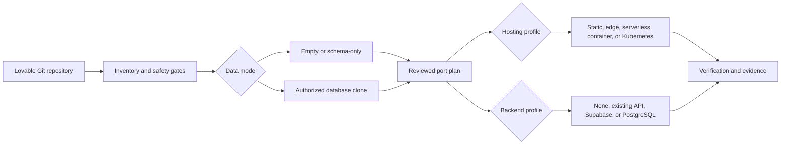

# Lovable Porting Agent

[](https://github.com/adamhjort/lovable-porting-agent/actions/workflows/tests.yml)

A model-neutral [Agent Skill](https://agentskills.io) and CLI toolkit for moving Lovable-generated applications to infrastructure you control.

It inventories code and backend dependencies, separates hosting from backend selection, identifies missing adapters, prepares approval-gated deployment plans, and optionally plans an authorized clone of an existing PostgreSQL database.

The same `SKILL.md`, deterministic scripts, and references work with Codex, Claude Code, and other Agent Skills clients. Client-specific UI metadata is optional and does not define the workflow.

> [!IMPORTANT]
> The normal deployment path is empty/schema-only and never copies database rows. Existing-data cloning is a separate explicit workflow with its own authorization, data classification, isolation, retention, and acceptance gates.

## What it does

- Detects Vite React SPAs and TanStack Start applications.
- Inventories Lovable and Supabase dependencies, migrations, Edge Functions, server routes, environment-variable names, and backend capability requirements.
- Flags hardcoded Lovable hosts, managed AI/email gateways, likely committed secrets, unsafe background work, and outbound database integrations.
- Selects hosting and backend independently.
- Generates target configuration templates and machine-readable plans.
- Distinguishes directly automated profiles from guided profiles that require provider-specific review.
- Supports empty/schema-only recreation, authorized full database clones, and quarantined sanitized clones.
- Produces redacted execution and smoke-test evidence.
- Preserves the source environment as the rollback path.

## Architecture



Hosting controls where application code runs. Backend controls database and application services. Neither choice silently determines the other.

## Agent compatibility

| Client | Personal skill location | Invocation |
| --- | --- | --- |
| Codex | `~/.agents/skills/port-lovable-app/` | `$port-lovable-app` |
| Claude Code | `~/.claude/skills/port-lovable-app/` | `/port-lovable-app` |
| Other Agent Skills clients | Client-defined | Client-defined or automatic |

Install for Codex:

```bash
git clone https://github.com/adamhjort/lovable-porting-agent.git ~/.agents/skills/port-lovable-app
```

Install for Claude Code:

```bash
git clone https://github.com/adamhjort/lovable-porting-agent.git ~/.claude/skills/port-lovable-app
```

Project-scoped installations can use `.agents/skills/port-lovable-app/` or `.claude/skills/port-lovable-app/`. Other clients can load `SKILL.md` while preserving access to `scripts/` and `references/`.

The optional `agents/openai.yaml` file contains presentation metadata for clients that understand it. Claude and other clients can ignore it. See [`references/agent-compatibility.md`](references/agent-compatibility.md).

## Hosting profiles

| Profile | Application shape | Support |
| --- | --- | --- |
| `cloudflare` | Edge and static | Direct |
| `vercel` | Serverless and static | Direct |
| `netlify` | Serverless and static | Direct |
| `aws-amplify` | Managed web hosting | Direct |
| `docker` | Portable local OCI build | Direct local build |
| `github-pages` | Static only | Guided workflow |
| `azure-static-web-apps` | Static SPA | Direct |
| `gcp-cloud-run` | Container | Guided |
| `aws-ecs-fargate` | Container | Guided |
| `railway` | Container or buildpack | Direct |
| `render` | Container or static | Guided Blueprint |
| `fly-io` | Container | Direct after `fly.toml` review |
| `kubernetes` | Container orchestrator | Guided GitOps/cluster workflow |
| `digitalocean-app-platform` | Container or static | Guided App Spec |

“Direct” means an allowlisted apply operation exists after all generated files and blockers are reviewed. “Guided” means the toolkit prepares compatibility checks and manual operations but does not claim provider provisioning or cutover happened automatically.

See [`references/hosting-edge-static.md`](references/hosting-edge-static.md) and [`references/hosting-containers.md`](references/hosting-containers.md).

## Backend profiles

| Profile | Included capabilities | Support |
| --- | --- | --- |
| `auto` | Resolves from inventory | Direct selection |
| `none` | No backend | Direct for frontend-only apps |
| `existing-backend` | Existing application-owned API | Guided |
| `supabase-managed` | Postgres, Data API, Auth, Storage, Realtime, Functions, RLS | Direct |
| `supabase-self-hosted` | Similar Supabase services | Guided and operations-heavy |
| `neon-postgres` | Postgres and RLS | Guided |
| `aws-rds-postgres` | RDS/Aurora PostgreSQL and RLS | Guided |
| `gcp-cloud-sql-postgres` | Cloud SQL PostgreSQL and RLS | Guided |
| `azure-postgres` | Azure PostgreSQL and RLS | Guided |
| `generic-postgres` | PostgreSQL and RLS | Guided |

Plain PostgreSQL does not replace Supabase Auth, Storage, Realtime, Edge Functions, or browser-facing Data API behavior. The inventory emits a blocker for each missing capability until a replacement adapter and contract tests exist.

`--backend auto` selects `supabase-managed` only when backend/Supabase requirements are detected; otherwise it selects `none`.

See [`references/backend-profiles.md`](references/backend-profiles.md), [`references/backend-supabase.md`](references/backend-supabase.md), and [`references/backend-postgres.md`](references/backend-postgres.md).

## Run the toolkit directly

Create a secret-safe inventory:

```bash
python scripts/inventory_repo.py /path/to/lovable-repo \
  --out /path/to/lovable-repo/.porting/inventory.json
```

Create an empty/schema-only deployment plan:

```bash
python scripts/make_port_plan.py /path/to/lovable-repo/.porting/inventory.json \
  --out /path/to/lovable-repo/.porting/plan.json \
  --app-name example-app \
  --hosting vercel \
  --backend supabase-managed \
  --backend-target-id empty-project-ref \
  --source-data-classification test-only \
  --source-auth-users 0 \
  --source-storage-objects 0 \
  --classification-evidence TEST-ENV-123
```

For a frontend-only app, use `--backend none` and omit `--backend-target-id`. For a guided backend, provide `--backend-readiness-evidence` after provisioning and compatibility work is reviewed.

Review operations without executing them:

```bash
python scripts/apply_port_plan.py /path/to/lovable-repo/.porting/plan.json \
  --repo /path/to/lovable-repo
```

Read [`SKILL.md`](SKILL.md) for the full workflow.

## Existing database cloning

The clone workflow supports:

- `full-clone`: an authorized complete copy from an immutable backup or restore point;
- `sanitized-clone`: a quarantined copy followed by application-specific masking and validation;
- Supabase managed Restore to a New Project;
- logical PostgreSQL dump/restore into supported PostgreSQL backends;
- reviewed provider-native migration services.

Example synthetic test-database clone:

```bash
python scripts/make_database_clone_plan.py \
  --out .porting/database-clone-plan.json \
  --app-name example-app \
  --mode full-clone \
  --method supabase-managed-restore \
  --source-database-kind supabase-postgres \
  --source-project-ref source-project-ref \
  --source-backup-id pinned-backup-id \
  --target-backend supabase-managed \
  --target-environment pre-production \
  --target-organization approved-organization \
  --source-data-classification synthetic \
  --source-auth-users 12 \
  --source-storage-objects 0 \
  --classification-evidence TEST-DATA-123 \
  --authorization-evidence APPROVAL-456 \
  --target-access-restricted \
  --egress-extensions-reviewed
```

The generated plan starts with `release_allowed: false`. Database clones do not implicitly copy Storage object binaries, Edge Functions, provider configuration, or secret values. See [`references/database-cloning.md`](references/database-cloning.md).

## Safety model

- Read-only inventory before mutation.
- Pinned, clean Git commit before deployment.
- Secret names only; never secret values.
- Aggregate metadata for classification.
- Empty/schema-only deployment by default.
- Separate approval and governance evidence for database cloning.
- Restricted, quarantined targets for copied personal data.
- Allowlisted direct commands and explicit guided operations.
- No source deletion, disconnection, pause, overwrite, or implicit teardown.

See [`references/safety-and-evidence.md`](references/safety-and-evidence.md).

## Test

The toolkit uses only the Python standard library:

```bash
python scripts/test_porting.py
```

## Project status

This is an independent, model-neutral migration toolkit. It is not affiliated with Lovable, Supabase, any hosting or database provider, OpenAI, or Anthropic. Provider APIs and adapters change; verify current official documentation before external provisioning, data transfer, or deployment.
